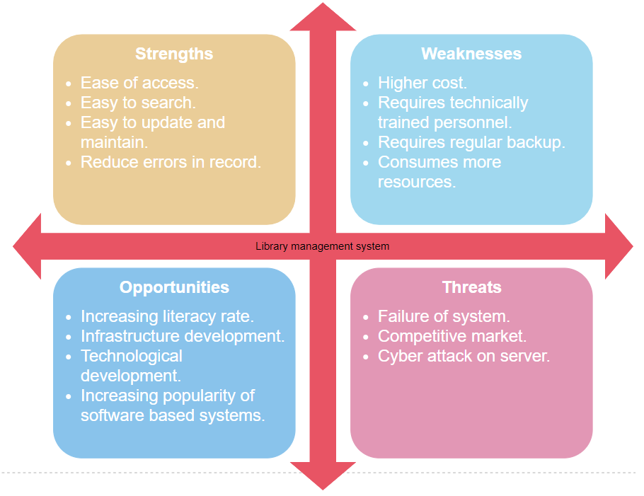

# Requirements
## Introduction
* For large libraries data management is one of the most important tasks.They need to keep a track of all their books as well as their status.
* This can be a very difficult task as libraries have a very large number of books and other articles.

## Research
### Benefits
* Easy record maintenace.
* Reduce data redundancy.
* Reducing entry of wrong data.
* Increasing security as only authorised personnel can access the data.
### Handicaps
* Requirement of techincally trained staff.
* High cost of system.
* Costly maintenance.
* Needs regular backup of data.

## Cost and feature
| ABCD | ABCD | ABCD | ACBD |
| ---- |----- |----- |----- |
| 1234 | 1234 | 1234 | 1234 |
| XYZ  | XYZ  | XYZ  | XYZ  |

## Defining our system
This system helps in the managing of data for a library. It includes following features:-
* View a record.
* Enter a new record.
* Update a record.
* Delete a record.

## SWOT Analysis

##  4W's 1H

### What
Database management system for libraries that helps to make record maintenance easy.

### Where
This system is required almost all over the world.

### When
This system is required from a long time as management of written records has a lot of limitations.

### Who
This system is required by almost all the libraries.

### How
A software will be developed by the team which will provide various data management features.

## Detail requirements

### High level requirements
|   ID   |     Description    |  Status  |
| :----: | :----------------: | :------: |
|  HLR1  |   View a record    |    TBD   |
|  HLR2  | Enter a new record |    TBD   |
|  HLR3  |   Update a record  |    TBD   |
|  HLR4  |   Delete a record  |    TBD   |

### Low level requirements
|   ID    |     Description    |  Status  |
| :------: | :----------------: | :------: |
|  LLR1  |   Search for a book by its ID and view information such as whether the book has been issued or not. If the status is issued when is the due date, the member who issued the book.   |    TBD   |
|  LLR2  |  Enter the details about a new book. |    TBD   |
|  LLR3  |   This is used to update the status of a book. If a book was issued or renewed changing the due date as well as status as issued or renewed respectively.  |    TBD   |
|  LLR4  |   This is used when a book is discarded.  |    TBD   |